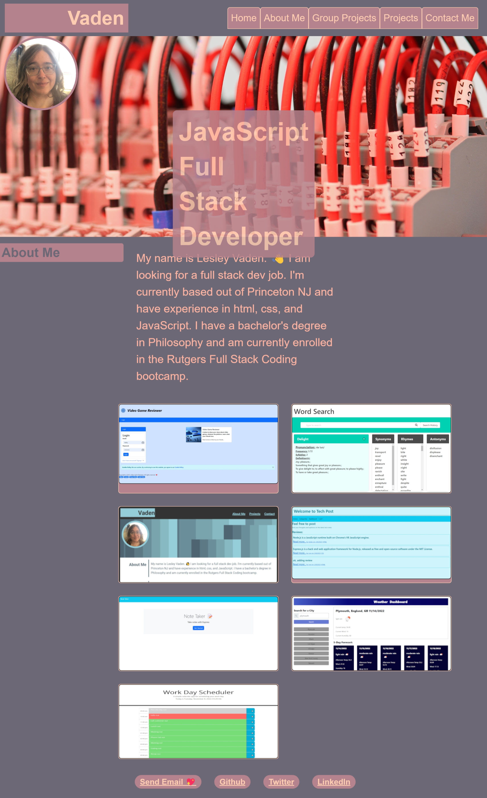

# react-portfolio

A react version of my portfolio

## Description

I'm excited to showcase my skills, learn more and to consolodate my best work. This portfolio contains relevant work that may interest potential employers and showcases examples of my work so that the viewer has a reasonable starting place with which to determine my fit for their organization. It was a good excuse to practice css skills and have fun with GitHub.

## Deployed Site
Visit the site at:
[Link to Page](https://lesley-byte.github.io/react-portfolio/)

## Screenshot

## Testing
There is no testing suite for this project.
## License
MIT License

## Contributing

There are no guidelines for contributing to this project. Feel free to fork the repo and make any changes you'd like.
## Questions
If you have any questions about this project, please contact me.

## Credits
I would like to thank my tutor, my TA, and my classmates for their help and support.